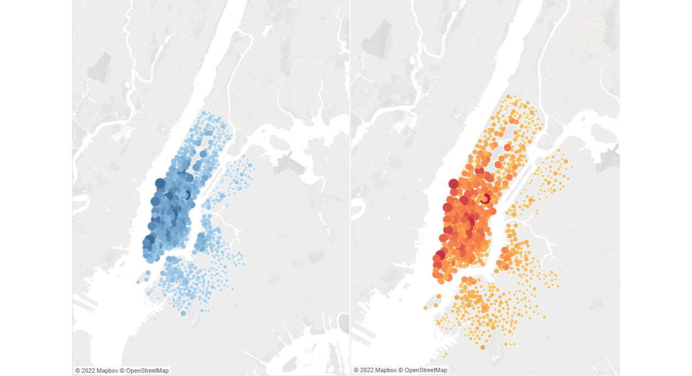

# Bikesharing
## Purpose
The purpose of this study was to determine the feasibility of bike sharing in cities outside of New York. Tableau was use to create a story to determine what makes CitiBike successful in New York, and to consider what needs to be done for the service to be successful elsewhere.

## Results

[NYC Citibike 1](https://public.tableau.com/app/profile/nicholas.henry/viz/NYCCitiBike_16631107501220/Story1)

The number of trips taken in August was 2,344,224. The majority of these riders were male and with an even larger portion representing subscribers to the service. The hour with the most rides started was 17:00 or 5:00pm. This is most likely due to rush hours and people opting to ride bikes rather than spend more time stuck in traffic with vehicles.

The most popular start and end location exist at Latitude 40.7175, longtitude -74.0123. Location popularity fades as the start and stop points move away from the city.

THe most used or oldest bikes will require the most maintenance. This visualization depicts which bikes are most likely to need repairs. The darker points of these charts show bikes that will need regular maintenance based on the number of trips and the longest trip durations.

[NYC Citibike 2](https://public.tableau.com/app/profile/nicholas.henry/viz/CitiBike2_16642531619720/Story1)

Five minutes is typically the longest time bikes are rented. This indicates that most people using them either live close to their work place or possibly use them to run short errands. Men take the most 5 minute trips.

Thursday from 5:00pm to 6:00pm is the busiest time for rides for both males and females.

Subscribers make up most of the riders and their day or preference for rides is also Thursday.

## Summary

The results point to the Citibike service being most popular among men who ride the most on Thursdays and Fridays. In New York City five minutes in the most popular duration for a ride. Further analysis is needed to determine why females are not more active in this service.
Two visualizations that may be considered for future analysis are:
    
    * Top Locations using the start and end station names instead of the latitude and lontitude. 
      This could give insight into why some locations are more popular.

    * Population barchart by gender and location to determine whether the level of usage by 
      gender is due to population differences or personal preferences.

